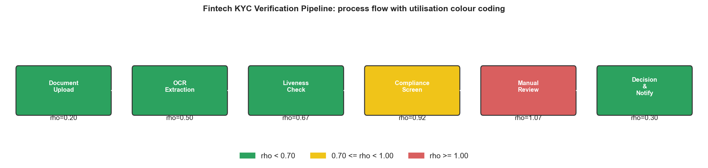
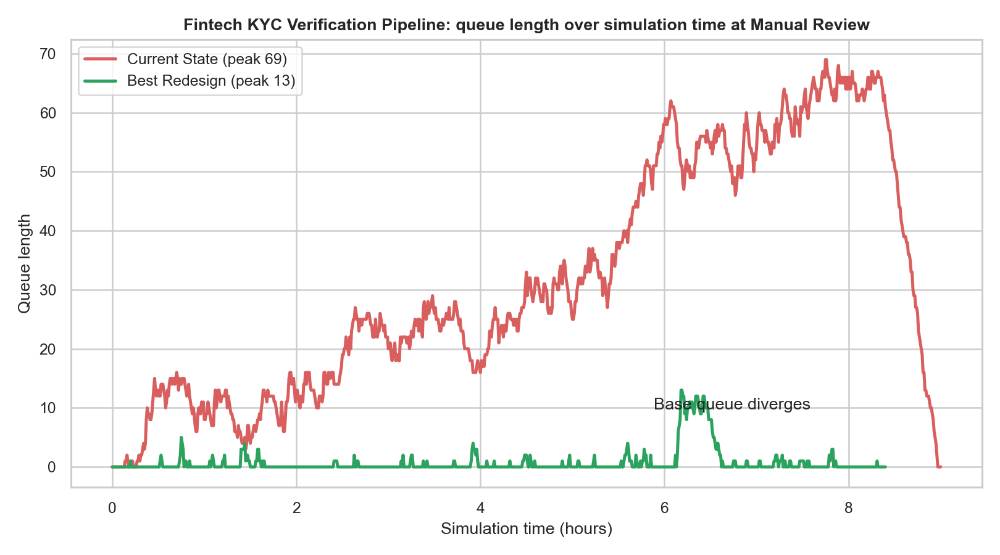
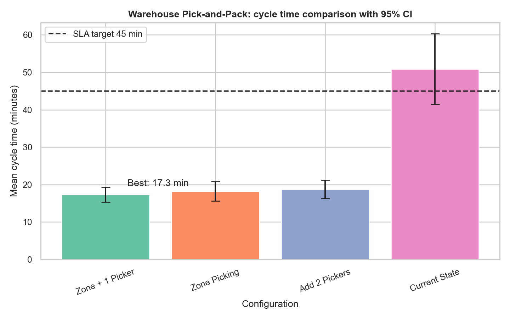
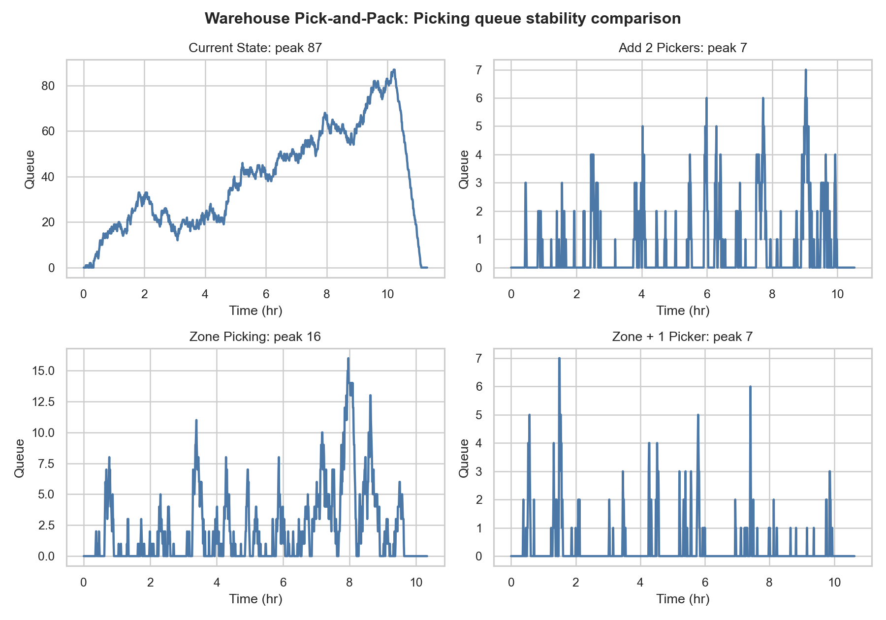

# Process Bottleneck Analysis

Discrete-event simulation and operations research project for diagnosing process bottlenecks, testing redesigns, and translating capacity improvements into business recommendations.

The project models two operating environments with the same reusable SimPy framework:

- Fintech KYC verification pipeline, framed for digital banking and Revolut-style onboarding operations
- FMCG warehouse pick-and-pack process, framed for P&G/ITC-style distribution operations



## Executive Results

| Scenario | Bottleneck | Current Cycle Time | Recommended Redesign | Cycle Time Reduction | Net Benefit |
|---|---:|---:|---|---:|---:|
| Fintech KYC | Manual Review, rho=1.07 | 30.3 min | ML Triage | 73.6% | Rs.11,384/hr |
| Warehouse | Picking, rho=1.11 | 50.9 min | Zone Picking | 64.2% | Rs.5,165/hr |

The current-state bottlenecks are overloaded in both scenarios, with utilisation above 1.0. The redesigns reduce effective bottleneck load or improve service productivity, then the project validates the changes through replicated simulation, demand stress tests, sensitivity analysis, and cost-benefit modeling.

## What This Demonstrates

- Analytical bottleneck identification using utilisation, Little's Law, and Erlang-C queueing estimates
- SimPy discrete-event simulation with route logic, finite-capacity resources, warmup removal, and queue monitoring
- 10 replications per configuration with 95% confidence intervals
- Three redesign options per scenario, including headcount, process redesign, and automation/triage choices
- Demand stress tests at +50% arrival rate
- Sensitivity analysis for arrival rate and bottleneck productivity
- Cost-benefit analysis with payback and hourly net benefit
- 18 publication-quality plots plus reproducible CSV outputs

## Repository Structure

```text
process_bottleneck/
|-- scenario_a_kyc.ipynb
|-- scenario_b_warehouse.ipynb
|-- simulation_framework.py
|-- run_analysis.py
|-- validate_project.py
|-- summary.md
|-- docs/
|   |-- methodology.md
|   `-- portfolio_case_study.md
|-- outputs/
|   |-- results_comparison.csv
|   |-- cost_benefit.csv
|   |-- stress_test.csv
|   |-- erlang_c_validation.csv
|   `-- *.png
`-- requirements.txt
```

## How To Run

Create an environment and install dependencies:

```bash
pip install -r requirements.txt
```

Regenerate simulations, plots, CSVs, notebooks, and summary:

```bash
python run_analysis.py
```

Validate the generated project artifacts:

```bash
python validate_project.py
```

Open the scenario notebooks:

```bash
jupyter notebook scenario_a_kyc.ipynb
jupyter notebook scenario_b_warehouse.ipynb
```

## Selected Visuals

### Fintech KYC: Queue Growth vs. Redesign



### Warehouse: Cycle Time Comparison



### Warehouse: Queue Stability Comparison



## Key Files

- `simulation_framework.py`: reusable DES engine, service-time sampling, Erlang-C analysis, replication logic
- `run_analysis.py`: scenario definitions, redesign experiments, sensitivity tests, cost-benefit logic, plot generation
- `summary.md`: final quantified recommendations and resume-ready bullets
- `docs/methodology.md`: modeling assumptions, validation approach, and limitations
- `docs/portfolio_case_study.md`: interview-friendly explanation of the project and business impact

## Reproducibility

Random seeds are fixed and incremented by replication. The first 150 items are discarded as warmup in every run. Queue lengths are monitored every 0.01 simulation hours. Confidence intervals use `scipy.stats.t.interval`.
